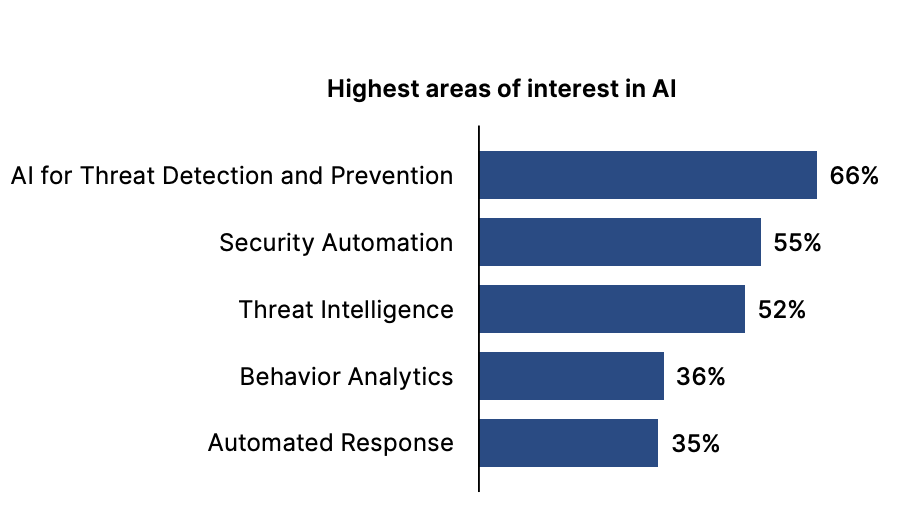

# 2025 Cybersecurity Skills Gap

* **Author & Year:** Fortinet Training Institute, 2025
* **Type:** Global Research Report
* **Sector:** Cyber Security
* **Source**: [Fortinet](https://www.fortinet.com/content/dam/fortinet/assets/reports/2025-cybersecurity-skills-gap-report.pdf) 

## SUMMARY
This Fortinet 2025 report examines AI's dual role in cybersecurity: 97% of organizations are adopting AI-enabled security solutions, while 49% worry about AI-driven attacks. The biggest challenge is lack of AI expertise (48%), though only 2% believe AI will replace cybersecurity roles.

## AI as Both Threat and Solution

* 49% of respondents worry that AI use by bad actors will increase cybersecurity attacks.

* 97% of organizations are using or planning to use AI-enabled cybersecurity solutions.

* 80% say AI tools are helping their IT and security teams be more effective.

## Implementation Challenges

* **Lack of staff with sufficient AI expertise (48%)** is the biggest challenge for implementing AI in cybersecurity.

* Ensuring data privacy and information security was a close second at 47%.

## Top AI Areas of Interest in Cybersecurity

## AI Won't Replace Cybersecurity Jobs

* 87% expect AI to enhance some or major aspects of cybersecurity roles.

* Only 2% think AI will replace their roles entirely.

## Training and Hiring Preferences

* 55% prefer vendor training to learn about AI-enabled cybersecurity solutions.

* 89% of IT decision makers prefer to hire candidates with certifications.