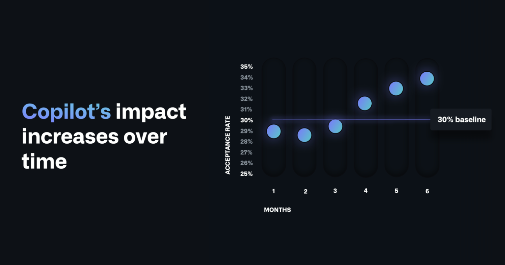

# The economic impact of the AI-powered developer lifecycle and lessons from GitHub Copilot

* **Author & Year:** Thomas Dohmke, Github, 2023
* **Type:** Industry Report
* **Sector:** Software Development
* **Source**: [Github Blog](https://github.blog/news-insights/research/the-economic-impact-of-the-ai-powered-developer-lifecycle-and-lessons-from-github-copilot/) 

## SUMMARY

This report by Github provides insights on how GitHub Copilot has transformed Software Development with increased productivity after a year of its release. Assuming consistent productivity gains, it predicts an increased demand for software and developers by 2030.

## KEY NOTES

### 1. Increased Productivity in Software Development

* An increased productivity was reported after a year of launch of GitHub Copilot as users accepted on average 30% of AI code suggestions.
* Overtime the average acceptance rate increased as users were more familiar with the tool.
 

### 2. Increased Demand for Software and Developers

* By 2030, it is projected that 45 million developers will bring about productivity gains of 15 million effective developers, contributing to the global GDP by 1.5 trillion.
* According to [Domhke](#quote-1), this increase in productivity would cause higher demand for software and developers. 
* In the context of Australia, this is consistent with the prediction by [ACS-2025](ACS_2025.md#7-workforce-demand) for additional 230,000 ICT workers by 2030.

## NOTABLE QUOTES

### QUOTE 1

"**We know that the demand for software and developers will likely increase**—as it has throughout the history of developer tools–and these productivity gains will continue to trigger an enormous impact, as developers seize new opportunities to utilize AI for solutions design and accelerate digital transformation worldwide."

-Thomas Dohmke, Github, 2023*

