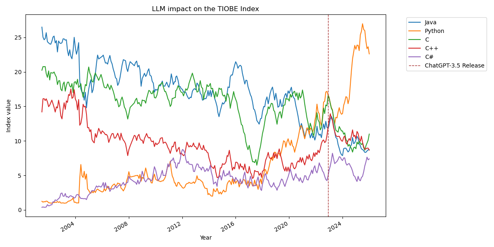

## LLMs impact on the TIOBE index?

* **Author & Year:**  TIOBE, 2025
* **Type:** Language popularity ranking (TIOBE)
* **Sector:** IT/Software Development
* **Source**: [TIOBE Index](https://www.tiobe.com/tiobe-index/) 

Python's TIOBE index rating has shown notable growth following the release of ChatGPT in late 2022. Python won the TIOBE language of the year for 2024 and in July 2025 reached 26.98%, the highest rating any language has achieved since the index began in 2001.

The question is whether this growth is causally related to LLMs or coincidental.

### Explanation from TIOBE

In August 2025, TIOBE CEO Paul Jansen explained that because AI systems are trained on existing code and Python has abundant training material, these systems excel at writing and understanding Python code.

TIOBE also observed a consolidation effect where popular languages are becoming more dominant while obscure languages decline.

*source: [infoworld](https://www.infoworld.com/article/4033860/python-popularity-boosted-by-ai-coding-assistants-tiobe.html)*

### Supporting Research

Stanford University research indicated that AI coding tools can boost efficiency by up to 20% when handling popular languages like Python.

*source: [porxify](https://proxify.io/articles/stanford-study-of-100000-developers-on-engineering-productivity)*

### Conclusion

LLMs appear to have had a notable impact on the index by amplifying Python's existing advantages. The feedback loop where Python's popularity leads to more training data, which improves AI performance with Python, which attracts more developers, suggests a causal relationship between LLM adoption.