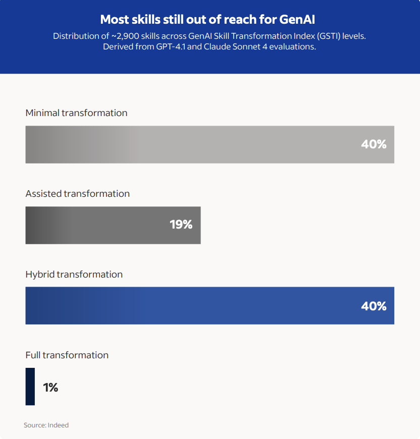
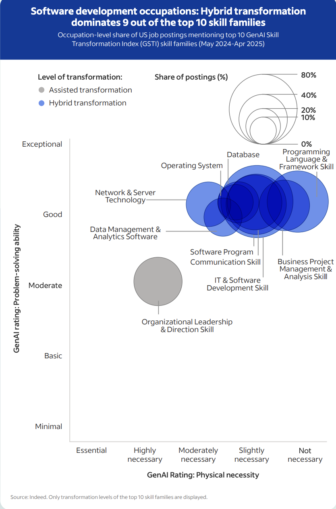

# AI at Work Report 2025: How GenAI is Rewiring the DNA of Jobs

* **Author & Year:**  Annina Hering, Arcenis Rojas, 2025
* **Type:** Industry Report
* **Sector:** Broader Labour Market
* **Source**: [AI at Work Report 2025](https://www.hiringlab.org/2025/09/23/ai-at-work-report-2025-how-genai-is-rewiring-the-dna-of-jobs/) 

## SUMMARY
This research by Indeed analyses the job posting data. It looks into what kinds of jobs will be most and least affected by Gen-AI by categorizing worker's skills into 4 categories based on potential for AI-driven transformation. The report highlights a major changes in Software Development and other ICT job postings.

## Degrees of Potential GenAI-Driven Skill Transformation

1. **Minimal transformation:** Human performance on these skills will likely remain unchanged.

2. **Assisted transformation:** Human leads, Gen AI supports.

3. **Hybrid transformation:** Gen AI prefroms bulk routine work along with human oversight.

4. **Full transformation:** Gen AI can independently use these skills, fully automating them. 

## Percentage of skills in each of the above categories

##  Large Share of Software Development Skills have Potential for Hybrid Transformation

* Above chart shows that 9 out of the top 10 skill families have potential for hybrid transformation where Gen AI can lead the process.

* Human software developers are likely to shift from doing the work to directing the work — overseeing AI outputs, sovling edge cases and ensuring quality control.

* In this way, GenAI is restructuring software development teams, potentially shrinking them as fewer workers will be needed to achieve the same result. **However, more workers may be needed if the output is expected to increase.**

## Top ICT Job Postings by Percentage of Skills Classified as Hybrid Transformation Skills:

1. Software Development: 81%
2. Data & Analytics: 79%
3. IT Infrastructure, Operations & Solutions: 71%
4. IT Systems & Solutions: 70%
5. Project Management: 62%

