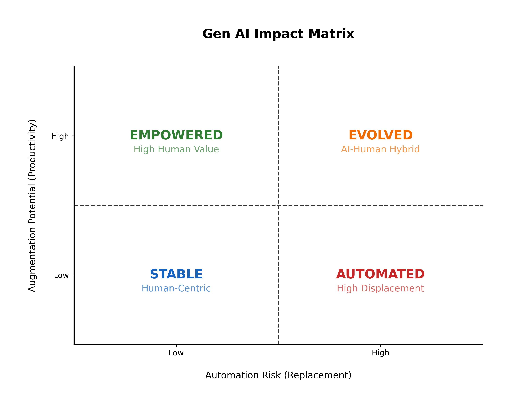
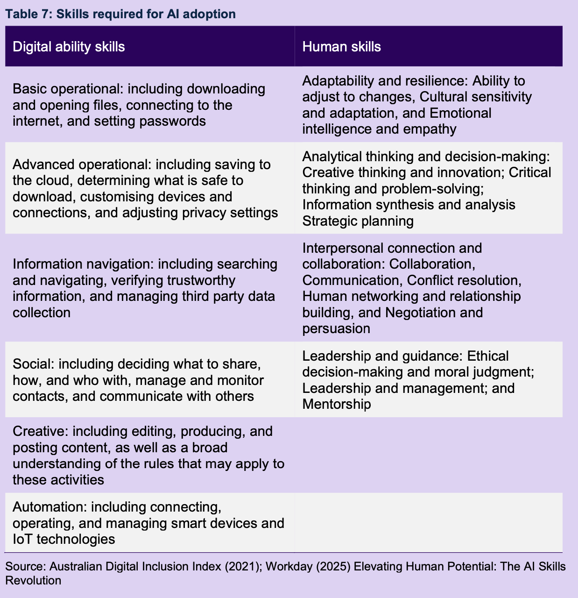

# Jobs and Skills Australia 2025: Our Gen AI Transition

* **Author & Year:** Jobs and Skills Australia, 2025
* **Type:** Government Report
* **Sector:** All ICT
* **Source**: [Our Gen AI Transition - Final release](https://www.jobsandskills.gov.au/publications/our-gen-ai-transition-final-release) 

## 1. Summary

This paper considers how the implications of Gen AI vary across the broader workforce, **not limitted to ICT**. It identifies an uneven exposure and adoption of Gen AI by different cohorts in the workforce (woman, first nations, people with disability). It underscores that Gen AI adoption can be positive or negative depending on the ability of individual workers to adapt to changes in occupations and workplaces, including their digital and human skills.

## Key Concepts: Augmentation vs Automation

* **Augmentation:** How much Gen AI could enhance or assist workers in performing their tasks.
    *Generally, jobs with **lower automation value** are considered safe (unreplaceable) while those with **higher automation value** are unsafe (replaceable).*

* **Automation:** The risk that Gen AI could replace or automate significant portions of the job.
    *Likewise, jobs with **lower augmentation value** are considered stagnant (minimal productivity boost by Gen AI) while those with **higher augmentation value** are considered advantageous (maximum productivity boost by Gen AI)*

*Figure 1: Gen AI Impact Matrix. Generated by Gemini (AI).*

## Key Skills for Gen AI adoption: Digital and Human Skills

**Digital and Human skills** possessed by workers are the key enabler of Gen AI adoption.

