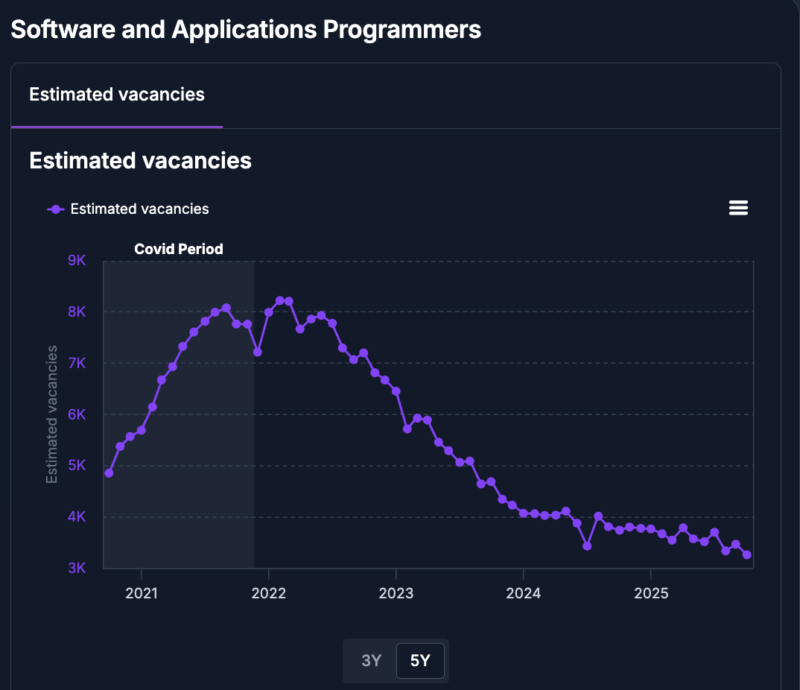
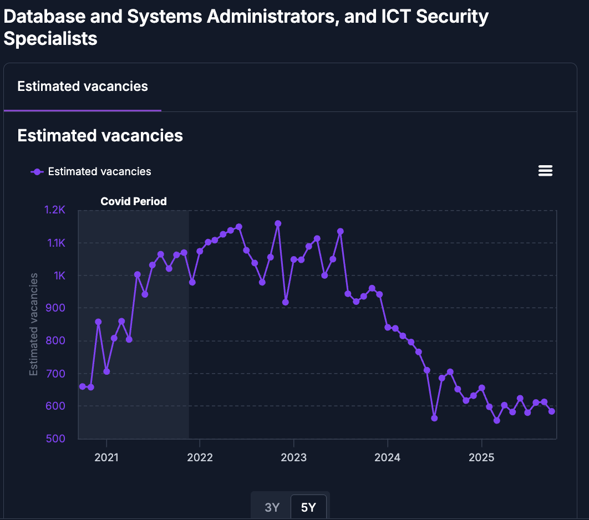
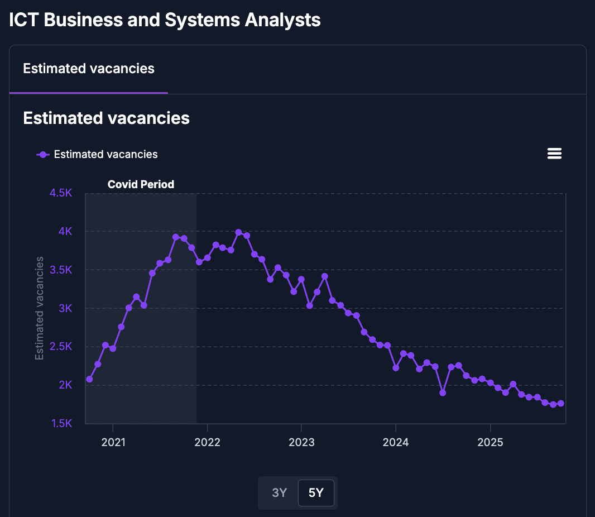
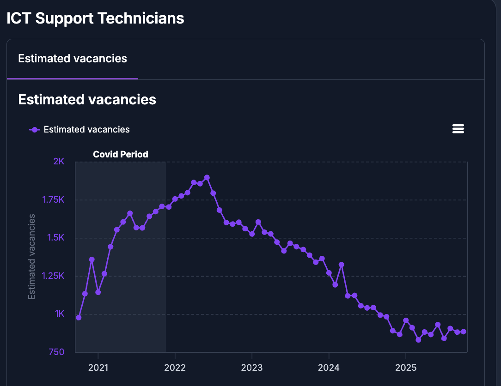
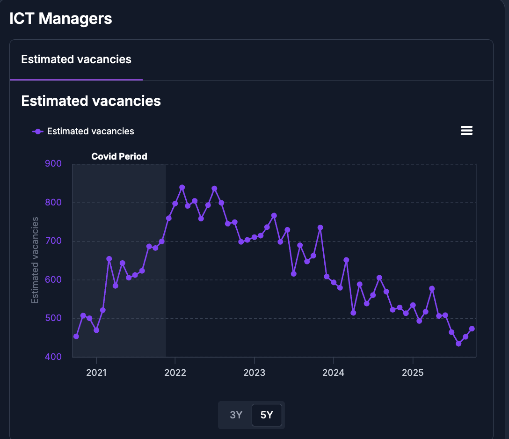
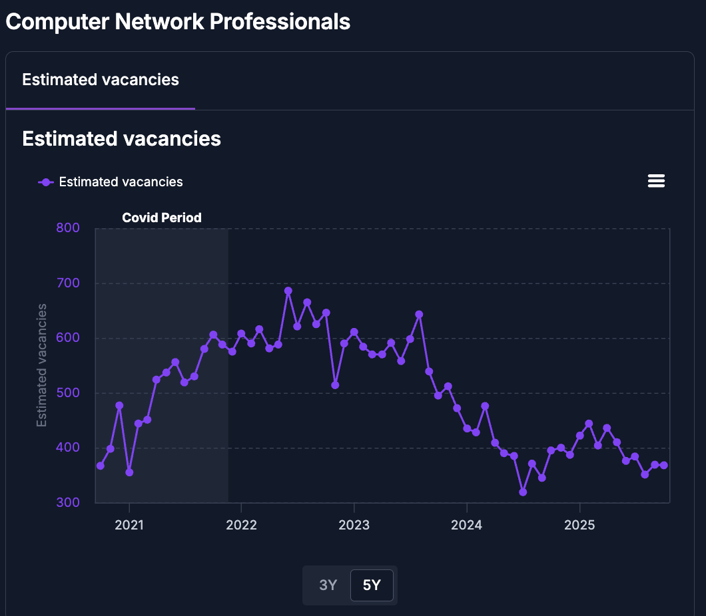
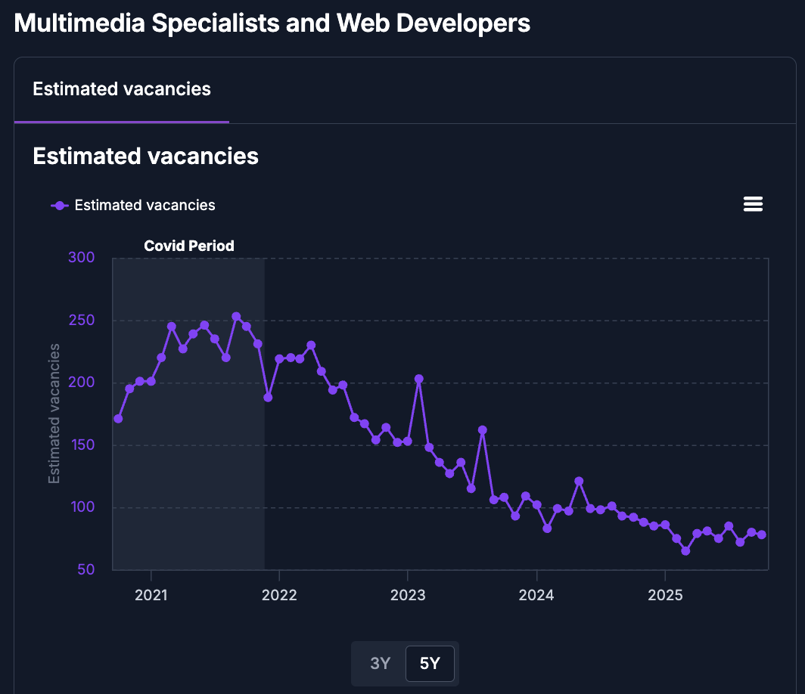

# JSA ICT Job Vacancies by Sectors

This file contains vacancy data across different ICT sectors in Australia over the past five years.

**Source:** [Jobs and Skills Atlas](https://www.jobsandskills.gov.au/jobs-and-skills-atlas/region/occupations?regionType=state&regionValue=aus)

## Quick links:
1. [Software and Applications Progammers](#1-software-and-applications-progammerssoftware-and-applications-progammers)
2. [Database and Systems Administrators, and ICT Security Specialists](#2-database-and-systems-administrators-and-ict-security-specialistsdatabase-and-systems-administrators-and-ict-security-specialists)
3. [ICT Business and Systems Analysts](#3-ict-business-and-systems-analysts)
4. [ICT Support Technicians](#4-ict-support-technicians)
5. [ICT Managers](#5-ict-managers)
6. [Computer Network Professionals](#6-computer-network-professionals)
7. [Multimedia Specialists and Web Developers](#7-multimedia-specialists-and-web-developers)

## 1. Software and Applications Progammers

## 2. Database and Systems Administrators, and ICT Security Specialists

## 3. ICT Business and Systems Analysts

## 4. ICT Support Technicians

## 5. ICT Managers

## 6. Computer Network Professionals

## 7. Multimedia Specialists and Web Developers

