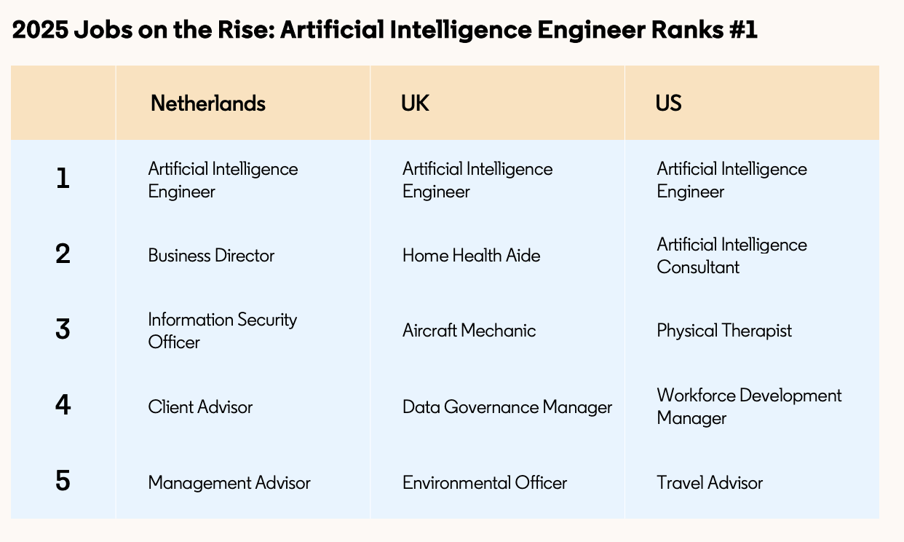
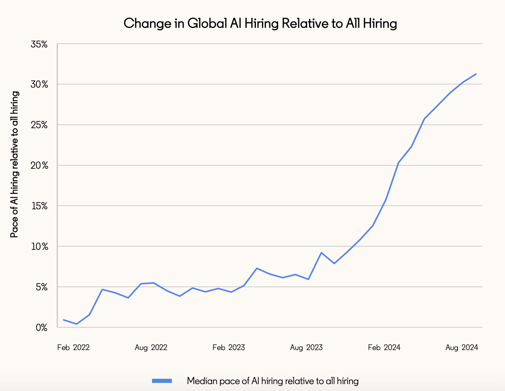

# Work Change Report: AI Is Coming to Work

* **Author & Year:** LinkedIn, 2025
* **Type:** Industry Report
* **Sector:** Broader workforce
* **Source**: [AI reports and resources](https://economicgraph.linkedin.com/content/dam/me/economicgraph/en-us/PDF/Work-Change-Report.pdf) 

## SUMMARY
This LinkedIn 2025 report examines AI's impact on workforce skills, finding that 70% of job skills will change by 2030 due to GenAI, with Artificial Intelligence Engineer emerging as the #1 job on the rise. The report highlights that both technical and human skills (like communication) are growing rapidly, while C-suite leaders (88%) prioritize AI adoption and increasingly seek adaptable candidates with AI literacy and agility. 

## Skills are Changing Fast

* By 2030, it is predicted that 70% of the skills used in most jobs will change due to Gen AI.

* Globally, there was a 20 times increase in AI skills being added to LinkedIn profiles since 2016.

* Likewise, there was a 140% increase in added skills in LinkedIn profiles since 2022, including **technical as well as human skills like communications.** 

## AI Adoption by Businesses

* 88% of C-suite leaders say AI adoption is important over the next year, consistent with the findings of [ACS-2025](ACS_2025.md#5-pathways-to-tech-jobs) in Australia.

## Artificial Intelligence Engineer as #1 Job on Rise

## Demand for Adaptive Talent is Rising

* "Companies want talent that will lean into new technology and can learn new technical skills whilem maintaining strong human skills."

* 38% of global C-suite executives prioritize **‘agility’** when considering entry-level candidates for their organizations, according to recent LinkedIn research. 

* AI talents are being hired 30% more than overall hiring as of Aug, 2024 with an increasing trend. .

* The percentage of jobs on LinkedIn listing an **AI literacy skill** increased more than six times over the past year. 

