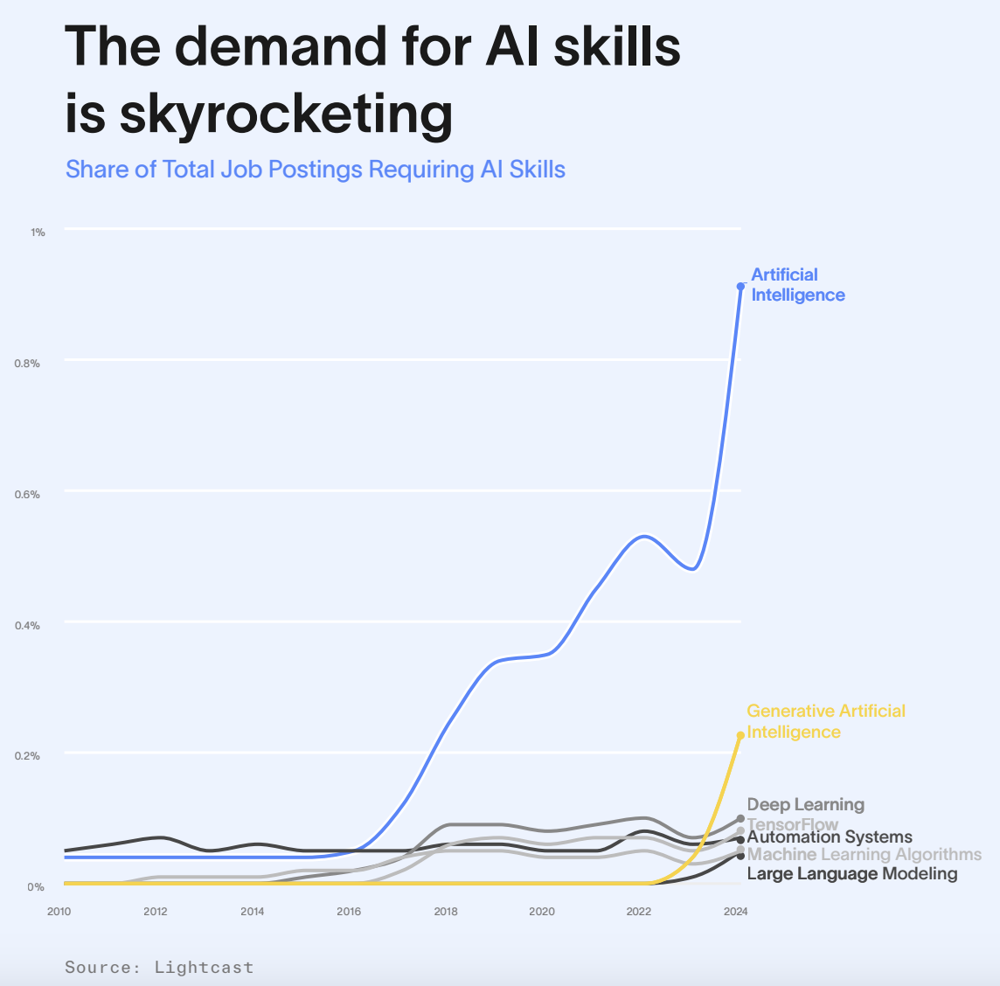
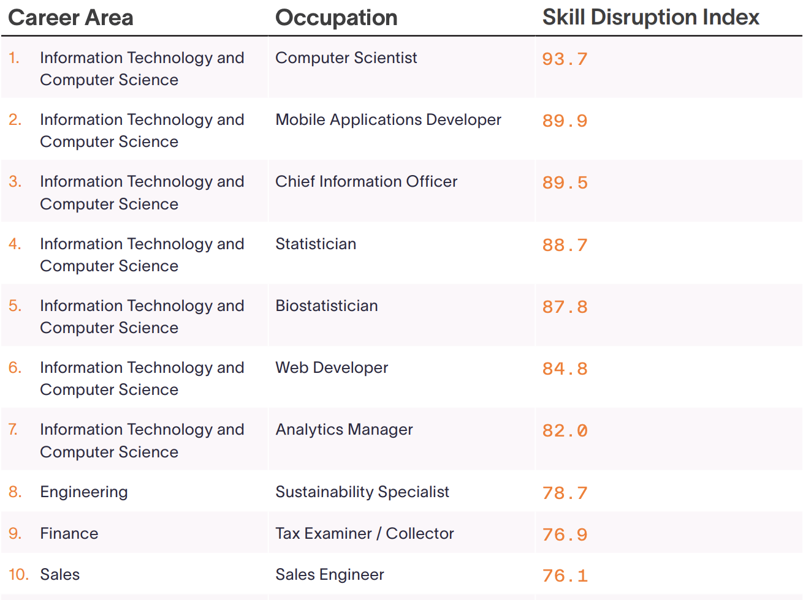

# The Speed of Skill Change

* **Author & Year:** US Lightcast, 2025
* **Type:** Industry Report
* **Sector:** US Workforce
* **Source**: [The Speed of Skill Change - Final release](https://4906807.fs1.hubspotusercontent-na1.net/hubfs/4906807/Speed%20of%20Skill%20Change_US_Lightcast-final.pdf) 

## Key Points

1. The average job has seen one-third of its skills change from 2021 to 2024. 
2. AI is causing more disruption than any other trend, followed by sustainability and cybersecurity. 
3. SKill Disruption Index Range: 0 - 100

## Generative AI Postings 

**Generative AI postings are up 15,625% from 2021 to 2024.**

* The following roles have been notably disrupted by AI skills:
1. Data roles: Data Scientists, Analytics Managers, and Data Engineers
2. Programming roles: Computer Scientists and Software Developers
3. Designers: Web Developers, Industrial Designers, and UI / UX Designers.

This disruption is likely due to the fact that generative AI is highly capable of generating and modifying code.

## Top 10 Occupations With The Highest Skill Disruption Index

