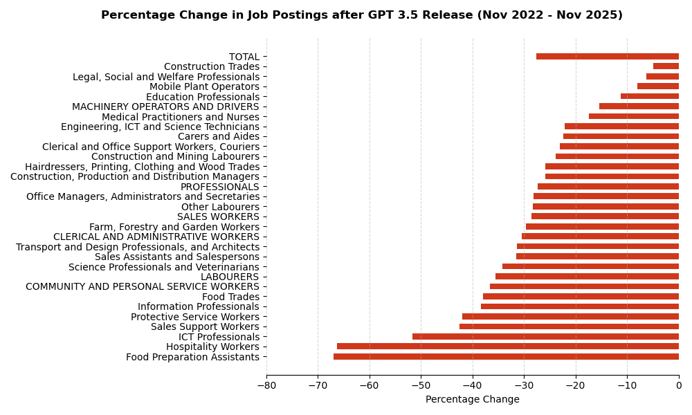
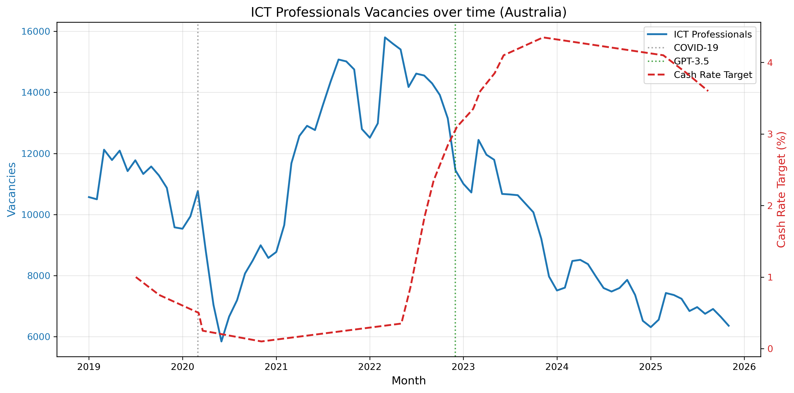

# AI IMPACT IN ICT JOB POSTINGS

There is obviously a decline in the number of job postings in ICT since GenAI started to become mainstream (Nov 2022, Release of GPT 3.5).

**But is GenAI the key driver of the decline?**

To answer this, we need to compare the change in job postings of ICT to other professions.

## Key Finding
**No.** GenAI is not the key driver.

## Evidence

### The Data
Top 5 declining job categories (Nov 2022 → Nov 2025):
1. **Food Preparation Assistants**: -66.9%
2. **Hospitality Workers**: -66.2%
3. **ICT Professionals**: -51.6%
4. **Sales Support Workers**: -42.6%
5. **Protective Service Workers**: -41.9%

**There was -27.63% decline on overall job posting across all sectors.**

### Why This Matters
- Food preparation and hospitality are identified as fields in which a larger share of skills fall into the minimal-transformation category, according to the [Indeed AI at Work Report (2025)](../../Literature_Review/Indeed_20205.md).
- These roles largely involve physical, in-person tasks that cannot be automated by generative AI.
- Yet they're declining **faster** than ICT roles.
- If GenAI were the sole cause, non-automatable sectors should remain stable.

## Other Possible Causes
**Macroeconomic factors** affecting all sectors:
- Cash Rate Target (Interest rate) hikes (RBA, mid-2022 onwards)
   
- Post-pandemic labor market correction after 2020-21 over-hiring

## Conclusion

While ICT job postings have declined 51.6% since November 2022, this trend cannot be attributed primarily to generative AI. The evidence shows that sectors with minimal AI automation potential—particularly food preparation (-66.9%) and hospitality (-66.2%)—experienced even steeper declines. With overall job postings down 27.63% across all sectors, macroeconomic factors such as interest rate increases and post-pandemic labor market corrections appear to be the dominant drivers of the observed decline in ICT vacancies.
