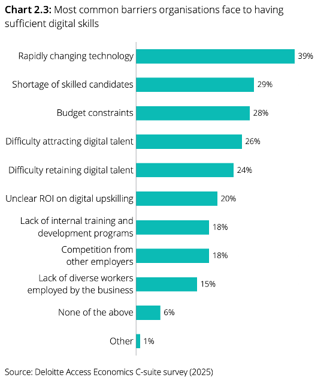
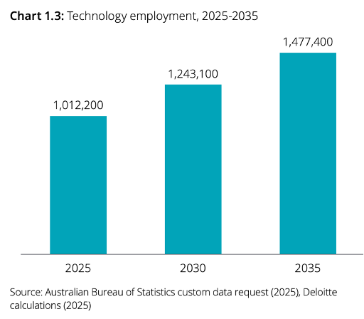

# PAPER TITLE: ACS Australia’s Digital Pulse 2025

* **Author & Year:** ACS, 2025
* **Type:** Industry Report
* **Sector:** All ICT
* **Source**: [ACS Australia’s Digital Pulse 2025](https://www.acs.org.au/campaign/digital-pulse.html) 

## SUMMARY

This survey of 1200+ Australian workers (800 tech, 400 non-tech) reveals technological skills gaps in workforce. It indicates a drop in job-readiness among ICT graduates (1% in 2024 vs 3% in 2023). It highlights the key AI skills to be developed and its barriers. It predicts the technology workforce demand to increase by 2030 and identifies the disconnect between what the technological leaders value vs the advertised requirements for new roles. It also highlights Australia's position in adopting AI, rise in AI-enabled cyberattacks, and the tech skill gaps in public sector.

## KEY FINDINGS

### 1. SKILLS GAPS 
 77% of tech workers believe they have at least one inadequate skill. The most common skills they believe are currently insufficient for their roles are as follows:
* Virtual and Augmented Reality (42% believe they are insufficient)
* AI and machine learning (41%)
* Robotic process automation (39%)
* cybersecurity (33%)

### 2. ARE GRADUATES JOB READY?
 Employers reported only 1% of ICT graduates are "job ready" in 2024 (down from 3% previous year). According to business leaders, following skills are lacking in the workforce:

 * Cybersecurity (45%)
 * AI and machine learning (40%)
 * Data analytics and visualization (35%)
 * Software development and engineering
 * Robotic process automation

  
### 3. AI SKILLS TO BE DEVELOPED:

### 4. BARRIERS TO SKILL DEVELOPMENT

### 7. WORKFORCE DEMAND
The report predicts, despite the current subdued growth in the ICT workforce, the need for additional 230,000 technology workers by 2030 to meet the demand for new applications created as a result of AI efficiency. 
 
 
### 5. PATHWAYS TO TECH JOBS
C-suite executives highly values VET/certifications but 88% still require university degrees for advertised tech roles.

### 6. AI ADOPTION IN AUSTRALIA: 
Australia is lagging behind in AI adoption, but 60% businesses expect to use agentic AI within 2 years.

### 8. AI-ENABLED CYBERATTACKS
 AI-enabled attacks doubled between 2023 and 2024, and are expected to grow in 2025.

### 9. DECREASE IN SOFTWARE PROGRAMMING ADS
Software programming ads down 10% suggesting structural changes from AI adoption.

### 10. PUBLIC SECTOR SKILL GAPS
 Half of public sector agency identify the shortage of general digital literacy skills. 

  
 
 ***Note:** 71% of Australian Government entities rely on legacy systems.*

 

